# KaseiCoin
> ERC-20 compliant smartcontract for a made-up coin called "Kasei Coin". This coin is minted using a deployer contract then it is added to a test ethereum network using Ganache, Metamask and Remix IDE. The test accounts in Ganache are used as supplier and buyer for this coin.

---

## Technologies
Languages: **Solidity ^0.5.5**

[Remix IDE](https://remix.ethereum.org/) - Fully fledged IDE for smart contract creation and testing online

[Open Zeppelin](https://docs.openzeppelin.com/contracts/2.x/) - Standards for smartcontracts using ERC20 protocols

---

## 3 Contracts Compiled - KaseiCoin, Crowdsale, Deployer

#### Original Kasei Coin Constructor

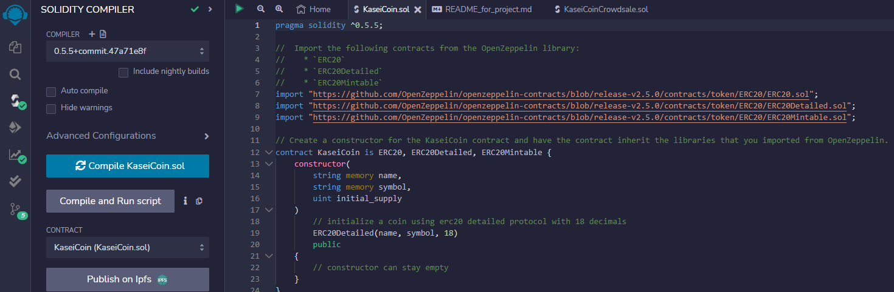

#### Crowdsale Contract

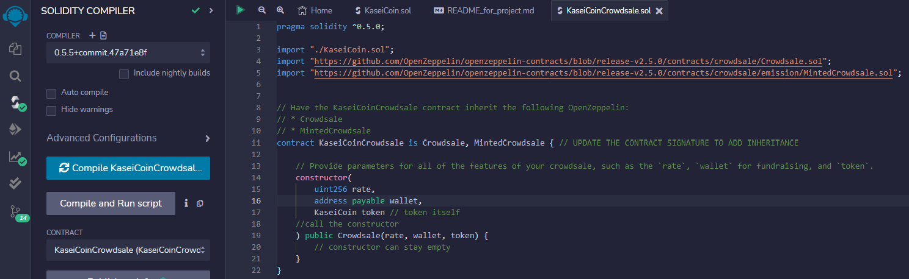

#### Deployer Contract

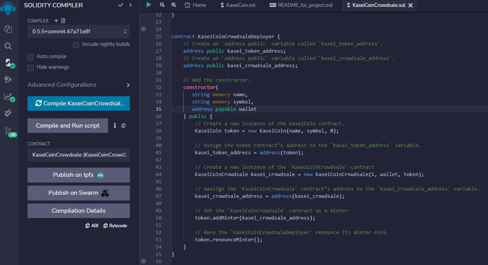

---

## Initial Ganache Values and Metamask Account Addition

#### Two accounts added in Ganache

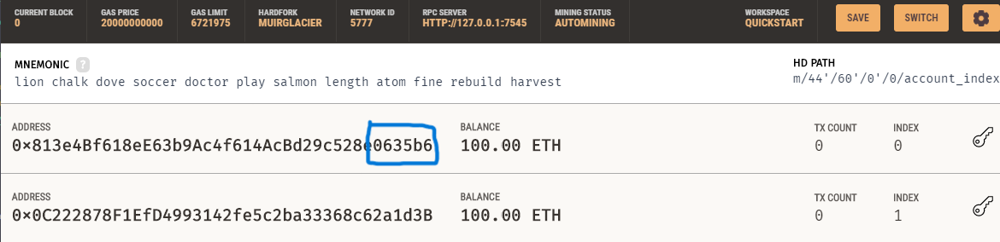

#### Metamask connection successful

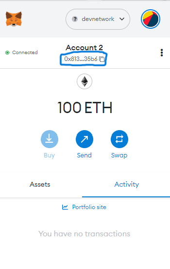

---

## Deployment 

#### Created Initial Coin

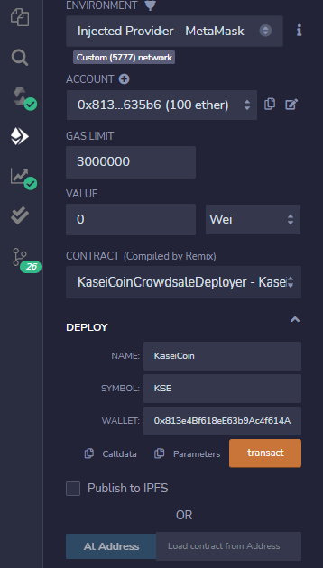

#### Shows up in Ganache successfully

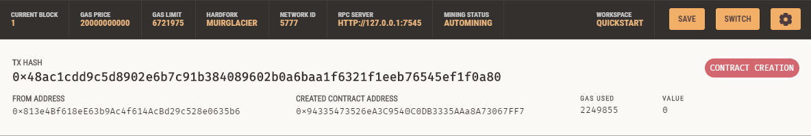

#### Small amount of gas to deploy

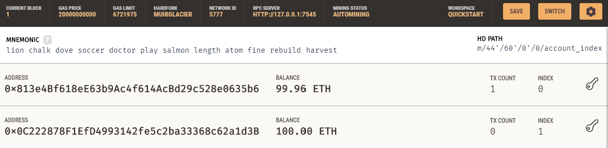

#### Linked the token and crowdsale address

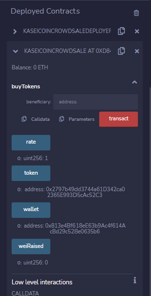

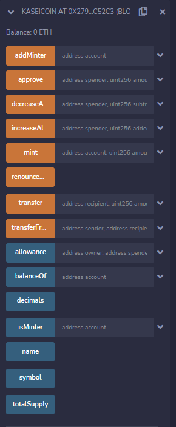

---

## Large Ether Buy

#### Other account purchased 20 Ether worth of KSE

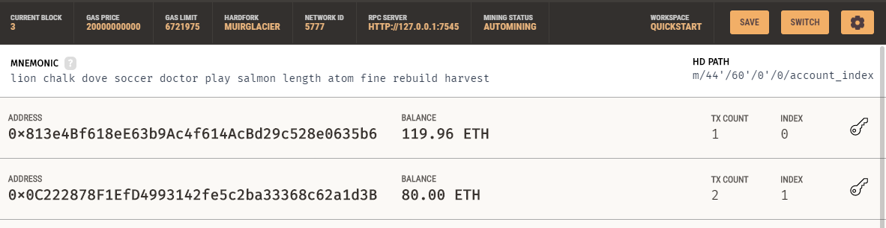

#### Shows up in transaction history

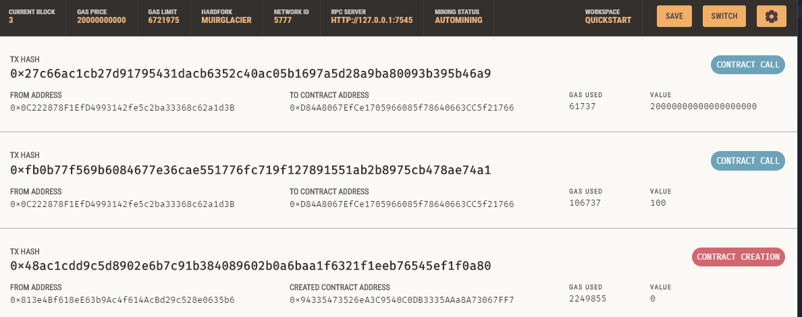

#### Shows up in Metamask

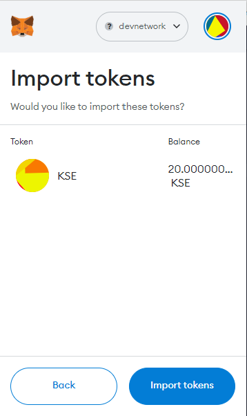

#### Total supply of KSE worth 20 Ether

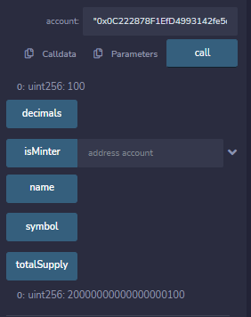

---

## Contributors

Created by Silvano Ross while in the UW FinTech Bootcamp
> Contact Info:
> email: silvanoross3@gmail.com |
> [GitHub](https://github.com/silvanoross) |
> [LinkedIn](https://www.linkedin.com/in/silvano-ross-b6a15a93/)

---

## License

- [MIT](LICENSE)
